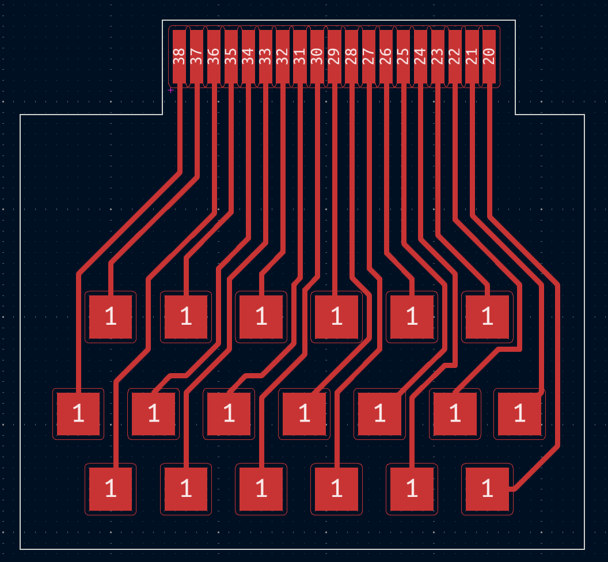
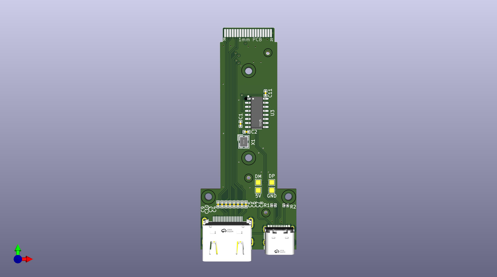
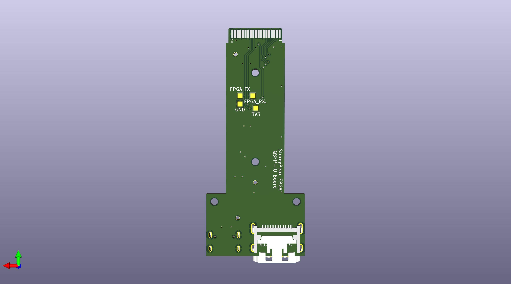

# QSFP to HDMI Breakout Boards

This repository contains two KiCad subprojects for the QSFP to HDMI breakout boards. These subprojects are designed to facilitate the conversion of QSFP signals to HDMI.

The concept has been created to be used on the Microsoft Stratix V FPGA accelerator card "Storey Peak". Jan Marjanovic has created a series of posts about the analysis of the card:

- [Part 1](https://j-marjanovic.io/stratix-v-accelerator-card-from-ebay.html)
- [Part 2](https://j-marjanovic.io/stratix-v-accelerator-card-from-ebay-part-2.html)
- [Part 3](https://j-marjanovic.io/stratix-v-accelerator-card-from-ebay-part-3.html)
- [Part 4](https://j-marjanovic.io/stratix-v-accelerator-card-from-ebay-part-4.html)
- [Part 5](https://j-marjanovic.io/stratix-v-accelerator-card-from-ebay-part-5.html)
- [Part 6](https://j-marjanovic.io/stratix-v-accelerator-card-from-ebay-part-6.html)
- [Part 7](https://j-marjanovic.io/stratix-v-accelerator-card-from-ebay-part-7.html)
- [Part 8](https://j-marjanovic.io/stratix-v-accelerator-card-from-ebay-part-8.html)

**The project was not tested or manufactured yet.**

## Subprojects

### 1. QSFP breakout board

The project is just a breakout board for the QSFP connector allowing connection to the QSFP on the FPGA board.

### 2. QSFP to HDMI and UART Adapter

This subproject focuses on the design and implementation of an adapter that converts QSFP signals to HDMI. The key features include:

- QSFP connector for input signals
- HDMI connector for output signals
- UART connector for debugging and monitoring
- 2 push buttons for user interaction
- 2 LEDs for visual feedback

## Contributing

Contributions are welcome! Please fork the repository and submit a pull request with your improvements.

## License

This project is licensed under the MIT License. See the [LICENSE](LICENSE) file for details.
